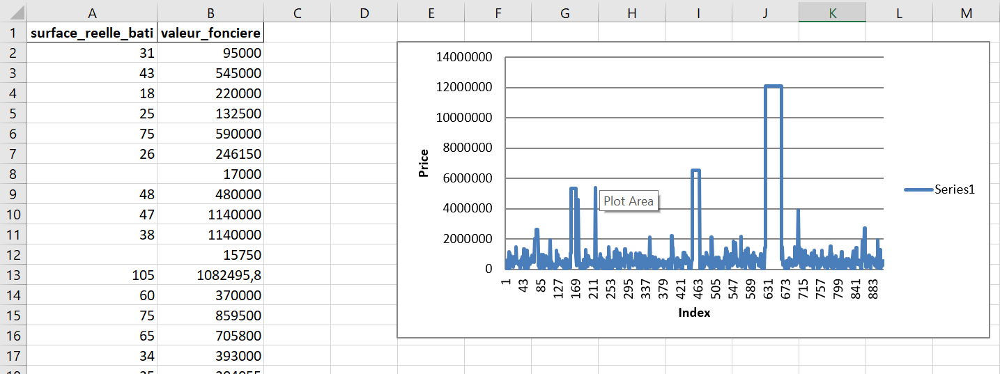
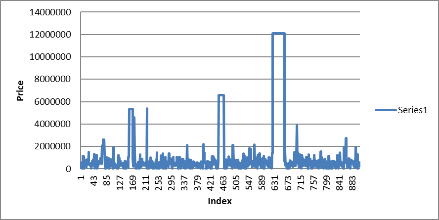

# Automate Excel and Word using Python

https://towardsdatascience.com/automate-microsoft-excel-and-word-using-python-ab92713b4ffe

https://automatetheboringstuff.com/2e/chapter13/


```
pip install openpyxl
pip install python-docx
```

## Excel automation
https://openpyxl.readthedocs.io/en/stable/

We get the price of real estate in Paris 14 from the following gist: https://gist.github.com/slevin48/05c0d4f348f0f10870a0fa721cfcb1b1

Adding manually a second sheet selecting only the surface and price

```python
workbook = xl.load_workbook('dvf14.xlsx')
sheet_2 = workbook['Sheet2']
```


```python
values = Reference(sheet_2, min_row = 2, max_row = sheet_1.max_row, min_col = 2, max_col = 2)
chart = LineChart()
chart.y_axis.title = 'Price'
chart.x_axis.title = 'Index'
chart.add_data(values)
sheet_2.add_chart(chart, 'e2') 
workbook.save('dvf14_chart.xlsx')
```

## Extracting chart

Access Excel through COM

```
pip install pywin32
```
```python
input_file = "C:/Users/.../Book1.xlsx"
output_image = "C:/Users/.../chart.png"
operation = win32com.client.Dispatch("Excel.Application")
operation.Visible = 0
operation.DisplayAlerts = 0
workbook_bis = operation.Workbooks.Open(input_file)
sheet_bis = operation.Sheets(1)
```

And use Pillow to grab image
https://pillow.readthedocs.io/en/stable/index.html
```
pip install pillow
```
iterate over all of the chart objects in the spreadsheet (if there are more than one) and save them in the specified location as such:

```python
for x, chart in enumerate(sheet_bis.Shapes):
    chart.Copy()
    image = ImageGrab.grabclipboard()
    image.save(output_image, 'png')
    pass
workbook_bis.Close(True)
operation.Quit()
```



