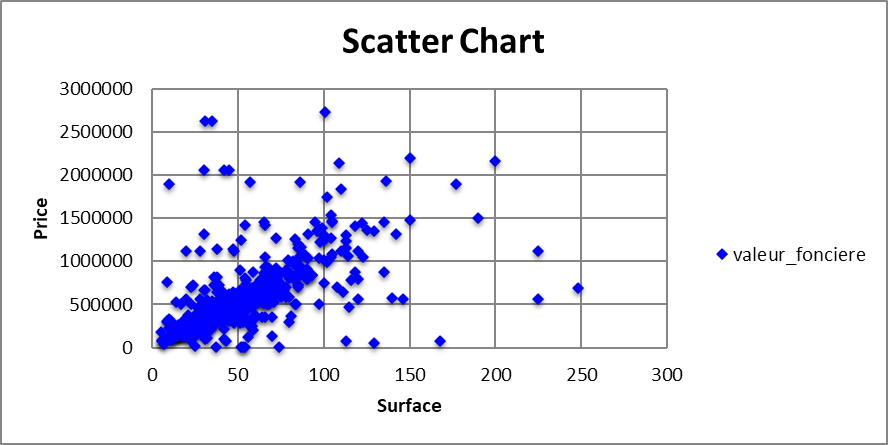

# Automate Excel and Word using Python


```
pip install openpyxl
pip install python-docx
```

## Excel automation
https://openpyxl.readthedocs.io/en/stable/

We get the price of real estate in Paris 14 from the following gist: https://gist.github.com/slevin48/05c0d4f348f0f10870a0fa721cfcb1b1

Adding manually a second sheet selecting only the surface and price

```python
workbook = xl.load_workbook('dvf14_chart.xlsx')
sheet_2 = workbook['Sheet2']
```


```python
chart = ScatterChart()
chart.title = "Scatter Chart"
chart.style = 13
chart.y_axis.title = 'Price'
chart.x_axis.title = 'Surface'

xvalues = Reference(sheet_2, min_col = 1, min_row = 2, max_row = sheet_1.max_row)
values = Reference(sheet_2, min_col=2, min_row=1, max_row=mr)
series = Series(values, xvalues,title_from_data=True)
series.marker.symbol = "diamond"
series.marker.graphicalProperties.solidFill = "0000FF" # Marker filling
series.marker.graphicalProperties.line.solidFill = "0000FF" # Marker outline
series.graphicalProperties.line.noFill = True  # hide lines
chart.series.append(series)

sheet_2.add_chart(chart, "D2")
workbook.save('dvf14_chart.xlsx')
```

## Extracting chart

Access Excel through COM

```
pip install pywin32
```
```python
input_file = "C:/Users/.../Book1.xlsx"
output_image = "C:/Users/.../chart.png"
operation = win32com.client.Dispatch("Excel.Application")
operation.Visible = 0
operation.DisplayAlerts = 0
workbook_bis = operation.Workbooks.Open(input_file)
sheet_bis = operation.Sheets(1)
```

And use Pillow to grab image
https://pillow.readthedocs.io/en/stable/index.html
```
pip install pillow
```
iterate over all of the chart objects in the spreadsheet (if there are more than one) and save them in the specified location as such:

```python
for x, chart in enumerate(sheet_bis.Shapes):
    chart.Copy()
    image = ImageGrab.grabclipboard()
    image.save(output_image, 'png')
    pass
workbook_bis.Close(True)
operation.Quit()
```



## Create Word report
https://python-docx.readthedocs.io/en/latest/

```python
from docx import Document

document = Document()
document.add_heading('Report on Excel and Word automation', 0)

...

document.save('dvf14_report.docx')
```


## Resources

- https://automatetheboringstuff.com/2e/chapter13/
- https://xkcd.com/1205/

